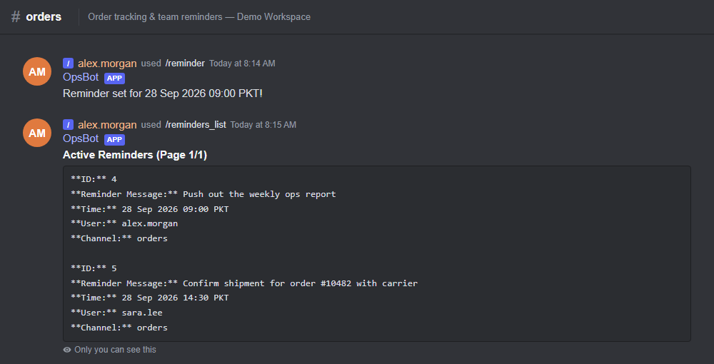
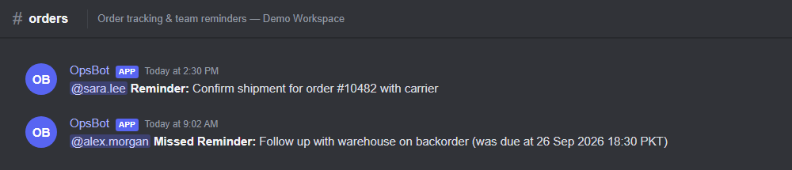
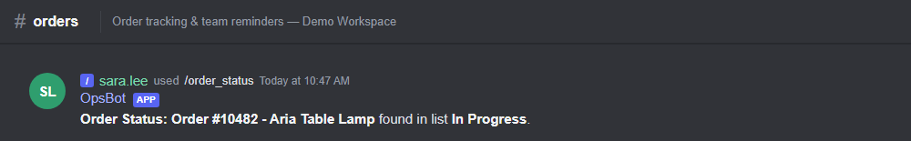
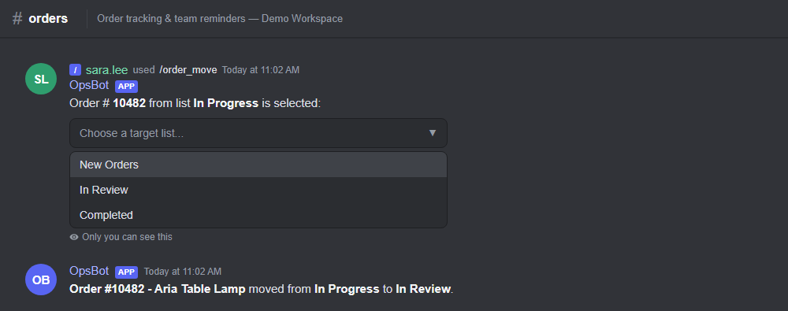
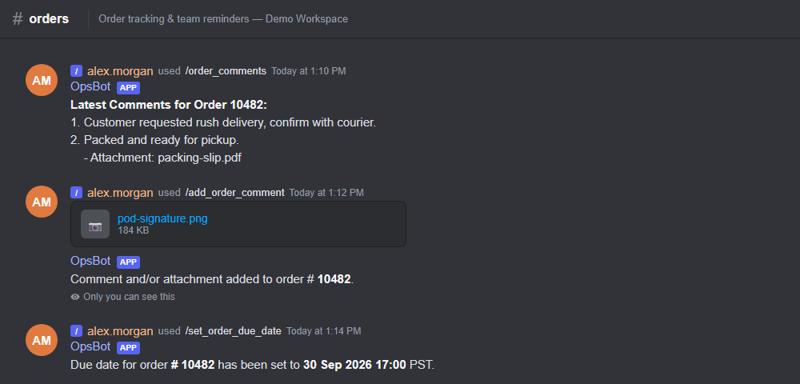

<div align="center">

# OpsBot: Discord Reminders & Trello Orders

**A Discord bot that brings team reminders and Trello order tracking into chat**

Built with Python · discord.py · Trello REST API · SQLite


</div>

---

## About

I designed and built this bot as an **in-house tool for the company I work at**. Our team tracked every customer order on a Trello board and coordinated in Discord. Checking an order meant leaving Discord, searching the board and copying details back. The bot removed that step: anyone can look up, move, comment on or schedule an order with a slash command, and set reminders that ping them in the right channel at the right time.

The project was developed with **AI-assisted engineering**: I used AI coding assistants to speed up building, refactoring and documenting the bot, while I owned the requirements, design, Trello workflow integration and final review.

> This public version contains no company data, tokens or board IDs. The screenshots use **fictional demo data**.

## Screenshots

| Set and list reminders | Reminder notifications |
|---|---|
|  |  |

| Order status | Move an order between lists |
|---|---|
|  |  |

**Comments, attachments and due dates:**



## Features

**Reminders**
- Set a reminder with a flexible date (`27 Sep`, `Sep 27 2025`; the year is optional) and a `HH:MM` time
- The bot mentions you in the channel where you created the reminder when it's due
- List active, past or all reminders; edit or remove them by ID
- Reminders persist in SQLite, and any reminder missed while the bot was offline is sent on startup, marked as missed
- Background task checks for due reminders every 10 seconds

**Trello orders**
- `/order_status`: find an order card by order number across every list on the board and show its details
- `/order_move`: move an order to another list, picked from a dropdown of the board's other lists (the picker is private to you; the result is posted to the channel)
- `/order_comments`: show the 3 latest comments on an order, with attachments uploaded around the same time (within 5 minutes) re-uploaded to Discord
- `/add_order_comment`: add a comment and optionally upload a file (up to 10 MB) straight from Discord to the card
- `/set_order_due_date`: set or change a card's due date

## Commands

| Command | Arguments | What it does |
|---|---|---|
| `/reminder` | `date`, `time`, `message` | Create a reminder |
| `/reminders_list` | `reminder_type` (active / past / both) | List reminders |
| `/reminder_edit` | `idx`, optional `new_date`, `new_time`, `new_message` | Edit a reminder |
| `/reminder_remove` | `idx` | Delete a reminder |
| `/order_status` | `order_num` | Look up an order on Trello |
| `/order_move` | `order_num` | Move an order to another list |
| `/order_comments` | `order_num` | Show an order's latest comments |
| `/add_order_comment` | `order_num`, `comment_text`, optional `attachment` | Comment on an order, with an optional file |
| `/set_order_due_date` | `order_num`, `date`, `time` | Set an order's due date |

## How it works

```
Discord ──slash command──▶ main.py (discord.py client, command tree, 10 s reminder loop)
                             │
                             ├──▶ reminder_commands.py ──▶ SQLite (database/reminders.db)
                             │
                             └──▶ trello_commands.py ──▶ Trello REST API (board lists, cards,
                                                          comments, attachments, due dates)
```

- Times are entered and shown in the team's local timezone (`Asia/Karachi`) and stored in UTC.
- An order is matched by the `#<number>` in a Trello card's name (for example `Logo design # 10482`).

## Tech stack

| Layer | Technology |
|---|---|
| Bot framework | Python, discord.py 2 (slash commands, UI components, `tasks.loop`) |
| Integrations | Trello REST API via `requests` and `aiohttp` |
| Storage | SQLite |
| Config | `python-dotenv` |

## Run it locally

**Requirements:** Python 3.10+, a Discord application with a bot user, and a Trello board with an API key and token.

1. **Get the code**
   ```bash
   git clone https://github.com/NazimAli28/Discord-Bot.git
   cd Discord-Bot
   pip install -r requirements.txt
   ```
2. **Configure credentials.** Copy `credentials.env.example` to `credentials.env` and fill in your Discord bot token, Trello API key, Trello token and board ID.
3. **Set up the Discord bot.** In the [Discord Developer Portal](https://discord.com/developers/applications), enable the **Message Content** intent for your bot, then invite it to your server with the `bot` and `applications.commands` scopes.
4. **Run**
   ```bash
   python main.py
   ```
   Slash commands sync on startup. The SQLite database is created automatically in `database/`.

To try the Trello commands, include `#` and an order number in a few card names on your board (for example `Logo design # 10482`).

## Project structure

```
├── main.py                  # Bot entry point: client, slash commands, reminder loop
├── reminder_commands.py     # Reminder storage and date parsing (SQLite)
├── trello_commands.py       # Trello API helpers (search, move, comments, attachments, due dates)
├── credentials.env.example  # Template for required secrets
├── requirements.txt
└── screenshots/             # README images (fictional demo data)
```

## License

Copyright © 2024-2026 Nazim Ali. All rights reserved. This repository is published for portfolio and demonstration purposes only. See [LICENSE](LICENSE).
